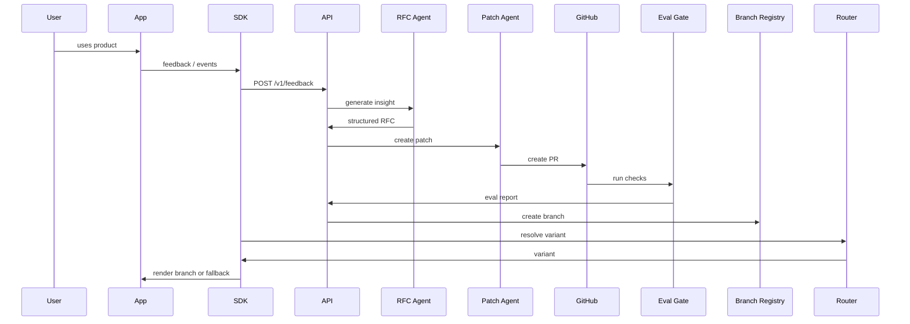

# EvoFork Architecture

## Purpose

EvoFork creates a governed loop from feedback to version forks.

```text
Feedback -> Insight -> RFC -> PR -> Eval -> Branch -> Route -> Observe
```

## Components

### SDK

Embedded in applications.

Responsibilities:

- submit feedback
- submit events
- request variants
- expose fallback behavior
- preserve host app stability

### Signal Hub

Receives and stores:

- feedback
- behavior events
- support summaries
- issue imports
- manual signals

### Insight/RFC Agent

Converts signals into structured product RFCs.

### Patch Agent

Generates constrained patches and PRs.

### Eval Gate

Validates AI-generated changes.

### Branch Registry

Tracks version forks and state transitions.

### Router

Resolves variants based on:

- surface
- segment
- rollout percentage
- sticky hash
- opt-out status

### Admin Console

Provides:

- feedback review
- RFC review
- branch management
- rollback
- audit logs

## Data flow



## Deployment modes

### Local demo mode

- in-memory or local database
- mock LLM
- no GitHub credentials required
- deterministic demo patches

### Developer mode

- local PostgreSQL
- GitHub token optional
- OpenAI-compatible LLM optional

### Production mode, future

- managed database
- secure GitHub App
- policy engine
- observability backend
- progressive delivery adapter

## Security boundaries

- Manifest controls editable surfaces.
- Patch Agent cannot merge or deploy.
- Router defaults to safe fallback.
- Feedback is never treated as instruction.
- Audit logs record agent actions.
